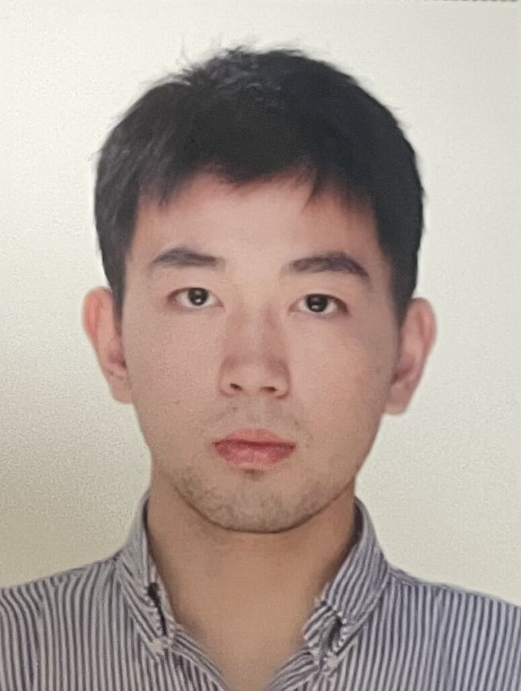

## Runze Liao  

This is [Tony's](https://github.com/tony8888lrz) webpage.
{:width = "200px" height="200px"}
  
He wishes u enjoy the music.  
<iframe frameborder="no" border="0" marginwidth="0" marginheight="0" width=330 height=120 src="//music.163.com/outchain/player?type=2&id=4237923&auto=1&height=66"></iframe>
### Education
2014-2020 [Chengdu Experimental Foreign Language School (Western Campus)](http://www.cdswxq.com/)  
2020-2024 [Southwest University](http://www.swu.edu.cn/) & [University of Auckland](http://www.uoa.edu.au/) Joint Bachlor programs  
2024-? [Simon Fraser University(Pending)](www.sfu.ca)  

### About  
This is Runze Liao, I am currently a forth-year bachelor’s student at Southwest University Joint Bachlor program (with University of Auckland), majoring in Computer Science.

Runze Liao is currently a Bachelor of College of Computer and Information Science, Southwest University, China and a Bachelor of the University of Auckland. He will receive B.S. from Southwest University and University of Auckland, C.N. & N.Z., His research interests include computer vision, graphics, and visual privacy attack. 
[CV](https://github.com/tony8888lrz/tony8888lrz.github.io/blob/main/CV_Runze_mitcas.pdf)

### Projects
Modeling Deep Learning Based Privacy Attacks on Physical Mail's Extension of Text [Text-Neural-STE(Coming soon)](https://github.com/tony8888lrz/Neural-STE_Text/)   

Swu-book-management-system [Data-Structure Curriculum Final Project(code)](https://github.com/tony8888lrz/swu-book-management-system)   

### News  

He awarded National Encouragement Scholarship in 2023.  
He awarded National Encouragement Scholarship in 2023.


```py
fn research_no_failure()->Result < Paper, Error > {
    let output = if cfg!(target_os = "linux") {
        Command::new("qemu-x86_64-system")
        .args(["-smp 6",
             "-numa node,cpus=0-2,memdev=mem0,nodeid=0",
             "-object memory-backend-ram,id=mem0,size=8G",
             "-numa node,cpus=3-5,memdev=mem1,nodeid=1",
             "-object memory-backend-ram,id=mem1,size=8G",
             "-m 16G,slots=4,maxmem=32G",
             "-machine q35,cxl=on",
             "-M cxl-fmw.0.targets.0=cxl.1,cxl-fmw.0.size=4G",
             "-device pxb-cxl,bus_nr=12,bus=pcie.0,id=cxl.1",
             "-device cxl-rp,port=0,bus=cxl.1,id=root_port13,chassis=0,slot=2",
             "-object memory-backend-file,id=cxl-mem1,share=on,mem-path=/tmp/cxltest.raw,size=256M",
             "-object memory-backend-file,id=cxl-lsa1,share=on,mem-path=/tmp/lsa.raw,size=256M",
             "-device cxl-type3,bus=root_port13,memdev=cxl-mem1,lsa=cxl-lsa1,id=cxl-mem0",
             "-device virtio-crypto-cxl,id=crypto0,cryptodev=cryptodev0",
             "-object cryptodev-backend-builtin,id=cryptodev0",
             "-object secret,id=sec0,file=./Drywall/passwd.txt"])
            .output()
            .expect("failed to execute process")
    }
    let paper = Paper::new(output);
    loop{
        asm!("clflush" :: "r" (&paper.iter()) : "rax", "rbx", "rcx", "rdx": "volatile" );
        __atomic_thread_fence(__ATOMIC_SEQ_CST);
        if (paper.is_valid()){
            break;
        }
    }
    Ok(paper)
}
```

For more information about this boy, you can find him in [scholar](http://scholar.com).

### Workspace

- He has done some work in his Undergraduate career :  [data structure](https://github.com/tony8888lrz/data-structure) & [c++](https://github.com/tony8888lrz/SWU-c-plus-plus) & [swu book management system](https://github.com/tony8888lrz/swu-book-management-system)   
- He is the initiator of this project :  [swu-cst-cracker](https://github.com/tony8888lrz/swu-cst-cracker) star[6]

### Contact

[ins](https://www.instagram.com/ttoooonnny/)   
[linkedin](https://www.linkedin.cn/incareer/in/ACoAADsXTKgBP0cHKc9Dhx7yOvdeLLMCxyaK9Os)  
wechat:runze324  
